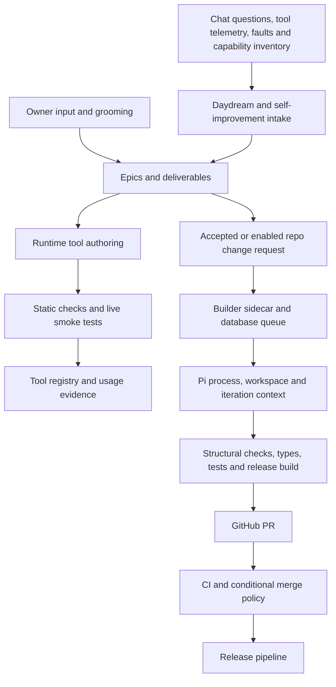
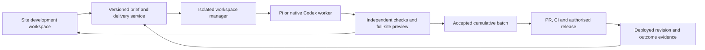

**Autonomous site development: architecture review and options**

Reviewed 7 September 2026. Recommendation: evolve the existing system into a site development workspace with replaceable coding engines. Retain Pi initially; evaluate native Codex alongside it. Prioritise product intake, reliable delivery state, isolated previews and acceptance evidence before increasing autonomous throughput.

**Scope and confidence**

This is a source-based architecture review, not a production reliability benchmark. The primary source is the cumulative checkout at `/home/john/sr-jkai-grounding-work`, based on `042719aa` with existing uncommitted developments. The local stack README identifies it as the JKAI/backlog preview. I also compared relevant committed files with the newer local checkout `/home/john/sr-shipped-work` at `cd634d0d`: the core builder, runner, executor, sandbox, git-target configuration, builder package and CI workflow have no committed differences across those revisions. The newer checkout includes further backlog board presentation work.

No production configuration, credentials, live build history or provider sessions were inspected. Historical measurements in code comments are useful incident context, not newly verified metrics. UI recommendations are based on components and their enclosing shell, not a fresh rendered usability test. No application changes or deployments were performed for this review.

**What exists today**

The architecture contains two distinct delivery paths, plus adjacent source, monitor and engine work:

The source supports whole-repository changes already. `selfimprove/propose.ts:changeRequestBody` explicitly asks for routes, schema, UI and tests. `jkai/git-targets.ts` supplies a complete repository clone, structural/type/test feedback, and a final site plus sidecar build. Pi is not inherently limited to chat tools.

Keep the following investments: epic grouping and merge history; structured grooming briefs with acceptance criteria, constraints, dependencies, open questions and revisions; the independent builder process; persistent queues, notes and logs; codegraph and neighbouring-code context; failure classification and budgets; split feedback/final gates; tool smoke tests and repair history; staged sidecar release activation. These are useful platform capabilities.

**Findings that should drive the redesign**

| Finding | Evidence in this checkout | Consequence |
|---|---|---|
| Discovery remains assistant-centred despite broader categories | `src/lib/selfimprove/analyze.ts` gathers recent chat questions, tool audits, custom-tool health, API/toolset inventory and Daydream sources. Its prompt now requests site features too. | Adding another category or changing the prompt cannot supply missing evidence about site journeys, navigation, accessibility, performance and owner product ambitions. |
| Runtime-tool success is much better represented than site-feature success | `src/lib/selfimprove/deployment.ts` models live handler tests, JKAI usage and tool promotion. | A new page or background service needs a different acceptance contract from a discoverable chat tool. |
| Delivery state is inconsistent across ledgers | `src/lib/selfimprove/propose.ts` sets backlog status to `shipped` immediately after change-request dispatch, but sets its capability to `building`. `board.ts:stageFor` can label a shipped non-tool item without a PR URL `live`. | A dispatch receipt can be mistaken for delivery. Board presentation alone cannot repair this underlying state problem. This is a source-visible path, not a claim about the number of affected live rows. |
| Recovery is limited | `orchestrator.ts:recoverOnStartup` marks running builds failed and continues queued work. `pi-runner.ts` uses `--no-session`. | Web deploys are separated from execution, but builder restart does not resume the active agent conversation. Workspace preservation is useful recovery material, not seamless continuation. |
| Steering is coarse | `executor.ts` drains pending user messages before calling `runPi`; Pi then runs with stdin ignored. | Existing inject/pin/interrupt controls are real, but an injected instruction is normally applied at the next outer iteration, not immediately inside the running agent loop. |
| Repository changes lack the normal preview path | `orchestrator.ts` bypasses standalone promotion/preview for git targets; successful gates lead to PR publication. Studio has additional browser/design checks in its own branch. | The owner cannot routinely judge a whole-site UI change through the same preview-and-feedback flow available for standalone artifacts. |
| Gate success terminates a repository build | The git-target completion branch uses `testResult.passed`; acceptance criteria reach the prompt but are not independently evaluated there. | Existing tests can pass while the requested behaviour is incomplete. Passing checks and satisfying a brief must be separate verdicts. |
| Isolation is at service level rather than per build | `sandbox.ts` and the service unit enable host mode, but the unit also applies substantial systemd hardening: read-only system/home, explicit writable paths, hidden environment/SSH/Docker-socket paths and stripped capabilities. | Preserve these protections. Builds still share the service's writable workspace roots and Pi configuration; per-attempt isolation would reduce cross-build access. The effective deployed unit was not verified. |
| Approval language does not describe the complete pipeline | `change-request.ts` records `planStatus: approved`; CI can merge non-draft, low-risk `agent/` PRs after successful gates when `AUTOMERGE_TOKEN` is configured. | “The builder never merges” is narrowly true but insufficient as a user promise. Plan acceptance, permission to build, permission to publish and permission to release need explicit meanings. |
| One controller handles several different products | The 2,237-line orchestrator coordinates general apps, Studio and repository builds; a single `activeBuildId` serialises execution. | Product-specific branching makes changes expensive. Separate policies and executors before adding worker concurrency. Line count alone is not a defect. |
| Fallback delivery changes the quality contract | `selfimprove/propose.ts` retains a path that authors new files without repository execution and opens an explicitly untested draft PR when the build lane is absent and PR access exists. | Missing execution capability should leave a ready brief with a clear blocker, or enter an explicitly selected proposal-only mode. It should not silently change what “build” means. |

There is documentation drift too: the builder README describes an infrastructure-only phase while RPC and authoritative orchestration are implemented. The code uses a `maxCostUsd: 2` ceiling, while some prose calls it £2. Treat spend, subscription quota and unavailable pricing as different accounting states.

**Options for the execution engine**

These are relative migration assessments, not measured performance rankings. Framework capability does not establish which one produces the best changes in this repository.

| Option | What changes | Benefit | Cost and limitation | Assessment |
|---|---|---|---|---|---|
| A. Improve the current Pi integration | Adopt persistent sessions and SDK/RPC integration; keep model routing and existing extensions. | Least disruption; keeps current context and tooling investments. | SR still owns durability, isolation, previews, policy and evaluation. Requires compatibility work against the installed pin. | Strong conservative option. |
| B. Native Codex worker | Add a direct Codex App Server adapter for repository builds. | Rich session, event and user-interaction interface suited to an embedded build workspace. | Another runtime to operate; existing Pi extensions need adapters; authentication and usage limits need validation. | Best initial challenger to Pi. |
| C. Claude Agent SDK worker | Integrate its TypeScript SDK and map tools/policies into it. | Library-based coding loop with hooks and permission controls. | Provider-specific integration and evaluation; SR delivery infrastructure remains necessary. | Credible alternative, especially if it wins task evaluations. |
| D. Adopt OpenHands for execution | Introduce its agent server and remote workspace model. | More of the coding-agent execution platform comes together. | Larger migration, including Python/server operations and SR integration; avoid duplicating its orchestration. | Consider if running an agent platform becomes a core objective. |
| E. Replaceable workers behind an SR-owned delivery contract | Begin with Pi plus one challenger, using common briefs, evidence and lifecycle state. | Engine choice becomes reversible and based on repository outcomes. | Requires a small, disciplined adapter boundary; implementing every engine at once would waste effort. | Recommended architectural direction. |

Pi's current upstream SDK documents persistent sessions, events, custom tools, steering and follow-up messages. Consequently, some current limitations belong to SR's one-shot integration rather than Pi itself. Those current APIs must be checked against the local `0.84.4` pin before implementation. [Pi SDK](https://github.com/earendil-works/pi/blob/main/packages/coding-agent/docs/sdk.md).

Codex App Server documents thread start/resume/fork, streamed events, approvals, steering and interruption. Use it directly for an embedded coding workflow. The existing `jkai-codex-bridge` serves a different purpose: translating individual model calls through a constrained CLI process. Its recorded overhead measurements do not establish the cost of a persistent native coding session. [Codex App Server](https://learn.chatgpt.com/docs/app-server).

Claude's Agent SDK supplies the Claude Code loop in TypeScript/Python with built-in tools, hooks, MCP and permissions. [Claude Agent SDK](https://code.claude.com/docs/en/agent-sdk/overview). OpenHands documents a Python SDK, REST agent server, Docker execution and model flexibility. [OpenHands SDK](https://docs.openhands.dev/sdk).

**Proposed system boundaries**

Keep the SvelteKit site as the place where the owner commissions and reviews work. The build service owns durable delivery state; the coding engine owns reasoning and tool execution within an assigned workspace. A separate verifier records evidence, and a release controller applies the authorised release policy.

Use a small worker contract: start, send instruction, interrupt, resume where supported, emit events, and return artifacts. Record capabilities explicitly: a worker that cannot steer or resume should say so. Keep budgets, release permissions and acceptance decisions outside model-generated text. Do not replace the current coding loop with a new general-purpose agent framework of your own.

Use Postgres claims/leases and idempotent transitions for jobs. Persist the brief revision, engine/session identity, base commit, workspace revision, pending decisions, attempts, checkpoints and evidence. A resumed session must reconcile interrupted commands and external actions; replaying a transcript does not make side effects exactly-once. Start with one implementation worker and a bounded verification queue. Resource measurement should determine later concurrency.

Create an isolated workspace per attempt with local-only database fixtures, scoped credentials and no host Docker socket. Keep branch creation and publishing credentials in a trusted broker. Treat the proposed checkout as untrusted test input: acceptance checks and release policy must come from a trusted revision, and edits to those controls require separate review. Use additive migration rehearsals and make irreversible migration gaps visible.

Preserve cumulative development: successful attempts integrate into one preview batch, with conflict resolution and combined checks before the batch is ready. Maintain an explicit batch base and included revisions so later work includes earlier accepted changes. PR creation is a separate requested step, matching the local workflow. The current branch-from-master and automatic-PR path does not by itself provide this batch model.

**Make the backlog a site product backlog**

Keep epics, deliverables, grooming conversations, accepted briefs, merge receipts and parked history. Give work independent dimensions: product area; user outcome; evidence/source; delivery form; risk; readiness; effort; dependencies; and release state. A page, database change and JKAI tool may all serve the same epic without being the same kind of deliverable.

Start with product areas such as News, Health, Intelligence, Maps, Decks, Public Site and Platform. Add owner priorities and a route/journey inventory to discovery. Scheduled audits can inspect accessibility, broken flows, empty/error states, performance regressions and missing cross-page functionality. Existing chat and Daydream evidence remains an input. Every suggested feature should explain who benefits, what changes and how success will be observed; speculative features should remain clearly identified hypotheses.

The grooming structure already contains most brief fields. Extend it with target routes/audiences, representative examples, visual references where needed, data/migration needs, and acceptance evidence. Tie authorisation to an accepted brief revision; material scope changes create a new revision rather than inheriting an unrelated approval.

Separate discovery cadence from build capacity. Use a small owner-selected “Next” queue and a review-capacity limit. Measure accepted improvements and useful outcomes instead of generated ideas or tools shipped. Avoid making a precise prioritisation score pretend uncertain estimates are facts.

**UI proposal: a persistent development workspace**

The highest-value UI work is connecting commissioning, decisions and evidence. Existing build controls already include plan and iteration approval, notes, interruption, budgets and model selection; reuse their capabilities while simplifying their presentation.

| View | Primary purpose | Main controls |
|---|---|---|
| Portfolio | Choose what the site should become | Product-area filters, outcome epics, Next queue, dependencies, capacity |
| Brief | Resolve the few choices that affect the result | Outcome, scope, examples, acceptance criteria, accepted revision, build policy |
| Build | See progress and supply timely direction | Plain-language current activity, decision inbox, steer, pause, stop, budget |
| Preview and review | Try the actual change | Desktop/phone preview, before/after evidence, criterion results, request revision, accept into batch |
| Delivery | Know what is available where | Batch contents, PR/CI status, deployed commit, release decision, post-release checks |

A desktop detail view can use a compact work list, central preview and contextual brief/evidence rail. On phones, make these separate views with an always-visible pending decision or preview action. Retain SR's paper/ink surfaces, ruled rows, existing typography and shared controls; avoid adding a second header or making terminal logs the main user experience.

Ask for decisions when an answer changes scope or behaviour. Persist questions so leaving the page does not lose them, and show whether a new instruction is queued, acknowledged or applied. Default controls should describe outcomes: “Explore”, “Build to preview”, “Request revision”, “Accept into batch”. Put provider settings and raw shell under advanced controls.

Separate permission to spend on implementation from permission to create a PR or release. A bounded task can run autonomously between meaningful checkpoints. The UI should not demand approval for every file edit or test run.

**Verification and truthful completion**

Store request state, attempt state, artifact state and release state separately. Derive the board from authoritative evidence. One candidate lifecycle is brief ready → queued → building → preview ready → accepted into batch → PR open → merged → deployed → outcome verified. Failed attempts remain attached to the same request. “Waiting for input” is an explicit state, not an apparent stall.

Keep current structural checks, full type checks and release/sidecar builds. Add tests selected for the work: real local-database checks for persistence and migrations; browser journeys for visible flows; public/owner access checks; accessibility and responsive checks where applicable. The normal `gate:test` excludes integration tests; CI runs selected integrations, which is not blanket coverage of a newly requested feature.

Each acceptance criterion should point to evidence from a specific revision. The verifier should be able to say “not exercised”, “blocked by missing provider”, or “requires owner judgement”. Record deployment evidence separately from candidate evidence, including the serving commit. Product impact might be an owner acceptance, completed journey or operational measure; a rarely used administrative feature need not accumulate arbitrary chat-tool calls to qualify as delivered.

**Recommended sequence and decision experiment**

1. Correct lifecycle semantics and document the actual runtime and merge policy. Retain old receipts; do not backfill unknown deployment status as success. Add brief/build/artifact linkage and job ownership semantics.
2. Ship one whole-site vertical slice through an isolated preview and cumulative batch. Use an existing non-chat request, with a real user journey and acceptance checks. Keep Pi during this step to measure the delivery infrastructure independently.
3. Introduce the small worker interface and evaluate persistent Pi against native Codex. Use the same task briefs, starting revisions, tools, resource limits and independent checks. Keep evaluation writes local.
4. Promote the better-performing engine for the task classes it demonstrably handles. Expand site discovery and capacity only after preview acceptance and recovery work reliably.

Suggested evaluation set: a visual page change; a multi-route feature with persistence; a background service change; a cross-site navigation/access change; a regression repair; and a runtime-tool task as a control. Include browser reconnection, builder termination mid-run, a failed migration, stale base commits and mid-run user correction. Repeat trials where feasible; a single successful demonstration is not an engine ranking.

Track acceptance pass rate, regressions, owner intervention minutes, time to usable preview, recovery success, spend/quota consumption and delivery-state accuracy. Record model, engine version, prompt/tool versions and environment identity. Require preserved constraints, no silent release, no lost accepted brief, and explicit evidence gaps. Compare model quality and harness behaviour separately when provider availability permits.

A successful first milestone is one broader site feature that the owner can commission, steer, try on a phone, revise, accept into the cumulative preview and later release with traceable evidence. That is the practical test of this architecture; another large queue of plausible tool ideas is not sufficient evidence of progress.
